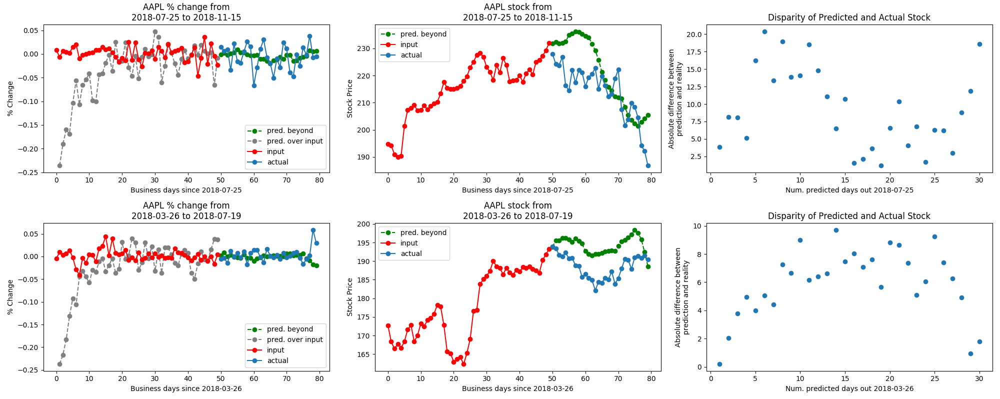

======================
Understanding the LSTM
======================
The first of our machine learning models is a long-term short-term memory (LSTM) network, which is a specific type of recurrent neural networks. Networks classified as recurrent neural networks allow information to persist between passes of data through the network; this is similar to how humans use memory to aid their immediate understanding of the world. As the name suggests, LSTMs have the capability to encode information about previous states - both recent and not - to inform their output (shown in diagram below). LSTMs are designed for sequential data, making them a logical choice for our application.

.. image:: ../../imgs/lstm.png

LSTMs can process sequences of arbitrary length with any pre-defined number of features, and output a sequence with a different and arbitrary number of features. To leverage these attributes, we pass in not only sequences containing the stock of the company we wish to predict, but also the stock prices of other companies. While stock prices are inherently unpredictable, we built our model on the notion that there there may exist learn-able relationships between companies' stocks.

We were not able to make generalizable conclusions about whether the model learned the relationships between companies' stocks, stemming from the unreliability of our predictions regardless of the number of companies added as features to the dataset, as well as issues with the model's predictions in evaluation mode. Below is an example of the model's output in training mode (meaning that dropout layers are utilized):

As can be seen, the model is able to generate a sequence that resembles the shape of the stock as well as the overall trend. On the left is the raw output of the model (trained on and outputting % changes of stock data), in the middle is the reconstructed from the percent change, and on the right is the disparity between predicted and actual stocks up to 30 days out from the training data.

When the model is in evaluation mode, the predicted % change is almost completely flat and 0; this is one of the weaknesses of the model and will be addressed with future work. One issue with the LSTM that was solved was the issue of there existing a constant offset between the output sequence and the input sequence; this was solved by increasing the hidden layer size. Whether this is an appropriate solution to that problem or a solution that masks an underlying problem is also an area for future exploration.
