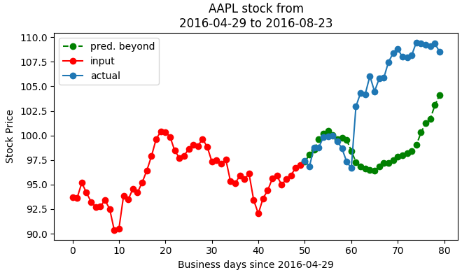
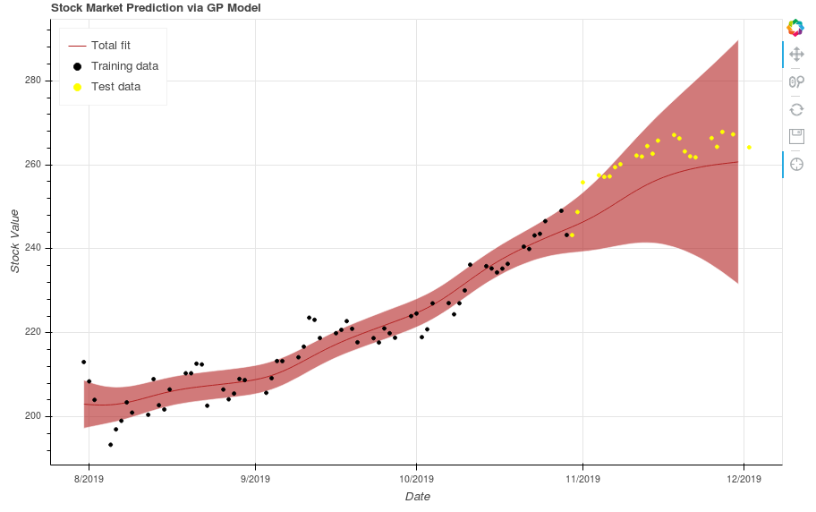

========
Examples
========

LSTM Example:
A model trained for 100 epochs to predict Apple stock with the added features of Microsoft, Google, and Motorola stock produced the output shown below. The results in are generated in training mode; in evaluation mode, the model predicts mostly homogeneous trends between input sequences. Further work is required to mitigate this issue and produce predictions that are more robust.

GPM Example:
Below is a plot of the GP being trained on three months of Apple stock data, and then being used to predict for an additional month. The shaded red region is a 95% confidence interval, and the dark red line in the center is the MAP - the *maximum a posteriori*, or the mean most likely prediction. As can be noticed, the predictions are only accurate for the first few days out.

Combined Model Example:

